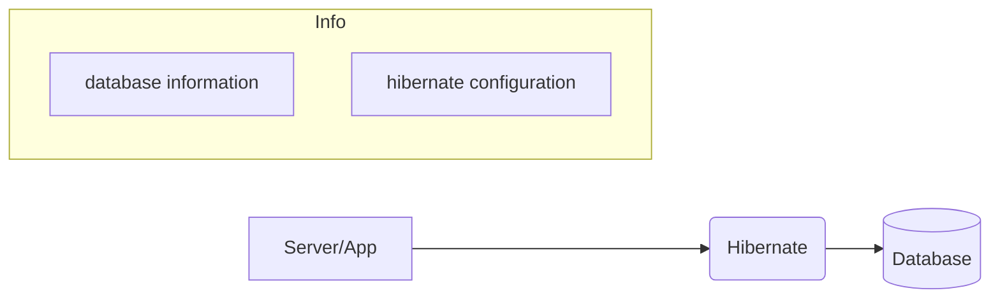

# Hibernate  [ORM Tool]

## 🛠 What is Hibernate?

Hibernate is a tool that allows you to interact with a database using only **Java Objects**. You don't have to worry about the rows and columns of a table; Hibernate maps your Java classes directly to those tables.

---

## 🚀 Why is it better than JDBC?

## 1. No "Boilerplate" Code

- **JDBC:** You have to manually write code to open connections, create statements, and loop through `ResultSet` to map data to objects.
- **Hibernate:** It handles all the "plumbing" work. You just call `session.save(object)` and you're done.

## 2. Database Independence (Dialects)

- **JDBC:** Your SQL queries are often tied to a specific database (like MySQL). If you move to Oracle, you might have to rewrite queries.
- **Hibernate:** You only change one line in the config file (the **Dialect**). Hibernate then automatically generates the correct SQL for the new database.

## 3. Automatic Table Creation

- **JDBC:** You must go to MySQL and run `CREATE TABLE...` manually before running your Java code.
- **Hibernate:** With the `hbm2ddl.auto` property set to `update`, Hibernate creates the tables for you based on your Java classes.

## 4. Smart Caching (Performance)

- **JDBC:** Every time you ask for data, JDBC hits the database, which can be slow.
- **Hibernate:** It has a **First-level Cache**. If you ask for the same "Student" twice in the same session, Hibernate gives it to you from memory the second time instead of hitting the database again.

## 5. Relationship Management

- **JDBC:** Handling "Joins" (e.g., a User having many Orders) requires complex SQL and manual mapping.
- **Hibernate:** You use simple annotations like `@OneToMany`. Hibernate manages the relationship and fetches the related data automatically.

---

## 📝 Summary

> **JDBC** is like building a house by hand, brick by brick.
**Hibernate** is like using a 3D printer; you give it the design (Java Class), and it builds the structure (Database Table) for you.
> 

---



---

## Hibernate Configuration Guide (`hibernate.cfg.xml`)

```xml
<?xml version="1.0" encoding="UTF-8"?>
<!DOCTYPE hibernate-configuration PUBLIC
	"-//Hibernate/Hibernate Configuration DTD 3.0//EN"
	"http://www.hibernate.org/dtd/hibernate-configuration-3.0.dtd">

<hibernate-configuration>
    <session-factory>
        <!-- Your database properties go here -->
    </session-factory>
</hibernate-configuration>
```

### 1. Database Connection Properties

These properties establish the "handshake" between your Java App and the MySQL 

| **Property** | **Value (Example)** | **Description** |
| --- | --- | --- |
| **connection.url** | `jdbc:mysql://localhost:3306/hiber` | The DB address: Protocol (`jdbc`), DB type (`mysql`), location (`localhost:3306`), and DB name (`hiber`). |
| **connection.username** | `root` | Your database login ID. |
| **connection.password** | `123456` | Your database secret key. |
| **driver_class** | `com.mysql.cj.jdbc.Driver` | The "translator" (driver) that helps Java talk to MySQL. *(Note: Use `.cj.`, not `.dj.`)* |

### 2. Hibernate Core Settings

Settings that define Hibernate's internal behavior and logging.

- **`hibernate.dialect`**:
    - **Value:** `org.hibernate.dialect.MySQL8Dialect`
    - **Purpose:** Tells Hibernate to generate SQL queries specifically optimized for MySQL 8 grammar.
- **`hibernate.show_sql`**:
    - **Value:** `true`
    - **Purpose:** Prints the generated SQL queries in the console. Great for debugging.
- **`hibernate.format_sql`**:
    - **Value:** `true`
    - **Purpose:** Makes the printed SQL queries look pretty and readable instead of a single messy line.

### 3. Schema Management (`hbm2ddl.auto`)

This is the most critical property for managing your Tables automatically.

> [!TIP]
**What it does:** It maps your Java Class (Entity) directly to a Database Table.
> 
- **`update`** (Most Common):
    - If the table doesn't exist, it **creates** it.
    - If you add a new field in Java, it **alters** the table.
    - **Result:** Data is preserved.
- **`create`**:
    - Drops the existing table and creates a fresh one every time the app starts.
    - **Result:** All old data is lost.
- **`validate`**:
    - Only checks if the Java Class and DB Table match. It makes no changes to the DB.

### 4. Mapping

- **`<mapping class="com.model.Student"/>`**:
    - Registers your Java Entity class with Hibernate. Without this, Hibernate won't know which class needs to be converted into a database table.

---

```
hibernate-crash-course/
├── src/main/java/                     <-- Saari Java files yahan
│   ├── com.hibernate.entities/        <-- Student.java (Entity)
│   ├── com.hibernate.utils/           <-- HibernateUtil.java (Utility)
│   └── com.hibernate.main/            <-- App.java (Main Execution)
│
├── src/main/resources/                <-- Configuration files yahan
│   └── hibernate.cfg.xml              <-- Hibernate ki settings
│
└── pom.xml                            <-- Dependencies (Hibernate, MySQL)

import com.mysql.cj.xdevapi.SessionFactory; ==>> Error 
use ==>> import org.hibernate.SessionFactory
```

```java
package com.hibernate;  //entitity class

import jakarta.persistence.Column;
import jakarta.persistence.Entity;
import jakarta.persistence.Id;
import jakarta.persistence.Table;
@Entity
@Table(name = "hiber")
public class entities {
    @Id
    private int id;
    @Column(name = "city")
    private String city;
    @Column(name = "name")
    private String name;

    public entities() {
    }

    public int getId() {
        return id;
    }

    public void setId(int id) {
        this.id = id;
    }

    public String getCity() {
        return city;
    }

    public void setCity(String city) {
        this.city = city;
    }

    public String getName() {
        return name;
    }

    public void setName(String name) {
        this.name = name;
    }
}

```

```java
package com.hibernate;  // main class

import org.hibernate.SessionFactory;
import org.hibernate.Session;
import org.hibernate.Transaction;

public class main {
    public static void main(String[] args) {
        SessionFactory sessionFactory = utils.getSessionFactory();

        try{
            Session session = sessionFactory.openSession();
            Transaction transaction = session.beginTransaction();
            entities Person = new entities();
            Person.setId(189);
            Person.setName("Rahul");
            Person.setCity("Mumbai");
            session.persist(Person);
            transaction.commit();
            System.out.println("Successfully Data Added!");
        }
        catch(Exception e){
            e.printStackTrace();
            System.out.println("Session is not Created");
        }
    }
}
```

```java
package com.hibernate;   //util class

import org.hibernate.SessionFactory; // Correct import
import org.hibernate.cfg.Configuration; // Correct import

public class utils {
    private static SessionFactory sessionFactory;
    static {
        try {
            if (sessionFactory == null) {
                // .configure() looks for hibernate.cfg.xml by default
                sessionFactory = new Configuration().configure().buildSessionFactory();
            }
        } catch (Exception e) {
            e.printStackTrace();
        }
    }
    public static SessionFactory getSessionFactory() {
        return sessionFactory;
    }
}
```

```java
<?xml version="1.0" encoding="UTF-8"?> <!-- hibernate.cfg.xml -->
<!DOCTYPE hibernate-configuration PUBLIC
        "-//Hibernate/Hibernate Configuration DTD 3.0//EN"
        "http://www.hibernate.org/dtd/hibernate-configuration-3.0.dtd">
<hibernate-configuration>
    <session-factory>
        <!--Database credentials -->
        <property name = "hibernate.connection.url">jdbc:mysql://localhost:3306/hiber</property>
        <property name = "hibernate.connection.username">root</property>
        <property name = "hibernate.connection.password">123456789</property>
        <property name = "hibernate.connection.driver_class">com.mysql.cj.jdbc.Driver</property>

        <!--Hibernate Core Configuration Settings -->
        <property name="hibernate.dialect">org.hibernate.dialect.MySQLDialect</property>
        <property name = "hibernate.show_sql">true</property>
        <property name = "hibernate.format_sql">true</property>
        <property name = "hibernate.hbm2ddl.auto">update</property>

        <!--Mapping -->
        <mapping class="com.hibernate.entities"/>

    </session-factory>
</hibernate-configuration>
```

## Commonly Use Hibernate Annotations


- How To Insert a Image in the table’s column
    
    ```java
    FileInputStream fis = new FileInputStream("src/main/pic.jpg");
               byte[] data = new byte[fis.available()];
               fis.read(data);
    
               address.setImage(data);
               //how to see in the Dbeaver ->  press F7       
    ```
    
- **Fetching Object | get() method | load() method**
    
    
    
- **📋 Hibernate Session Methods: Core Reference**
    - 1. Session Management
        - **`openSession()`**: Creates a brand new physical connection to the database. You must manually close this session.
        - **`getCurrentSession()`**: Binds the session to the lifecycle of the current transaction. It closes automatically when the transaction ends.
        
    - Persistence (Saving Data)
        - **`save(object)`**: Inserts a record and returns the generated identifier (ID).
        - **`persist(object)`**: Similar to `save`, but follows JPA specifications and does not return the ID (void).
        - **`saveOrUpdate(object)`**: A "smart" method. It inserts the record if it's new or updates it if it already exists.
    - Retrieval (Fetching Data)
        - **`get(Class, ID)`**: Fetches data immediately (**Eager**). Returns `null` if the ID is not found. Use this when you are unsure if the data exists.
        - **`load(Class, ID)`**: Returns a proxy (placeholder) and only hits the database when you access the object's properties (**Lazy**). Throws an exception if the ID is not found.
    - Updating & Synchronizing
        - **`update(object)`**: Re-attaches a detached object to the session to save changes.
        - **`merge(object)`**: Copies the state of a detached object into a managed entity. Best used when the session already contains a similar object to avoid conflicts.
        - **`flush()`**: Forces all pending memory changes to be synchronized with the database immediately.
    - Deletion & Cleanup
        - **`delete(object)`**: Removes a specific record from the database.
        - **`clear()`**: Completely clears the session cache, detaching all objects.
        - **`close()`**: Ends the session and releases the database connection.
    
    ---